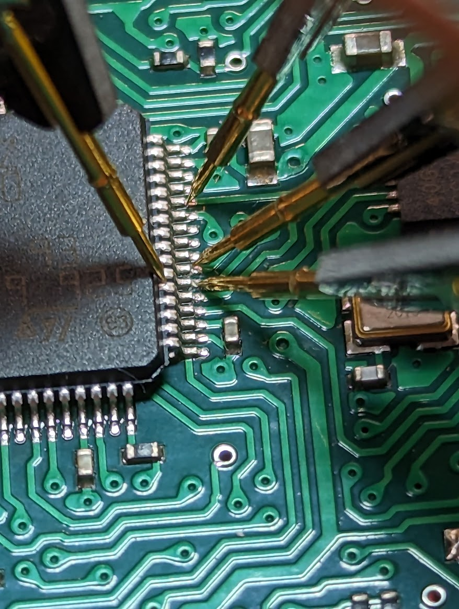
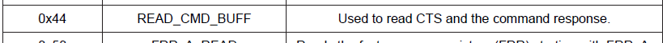
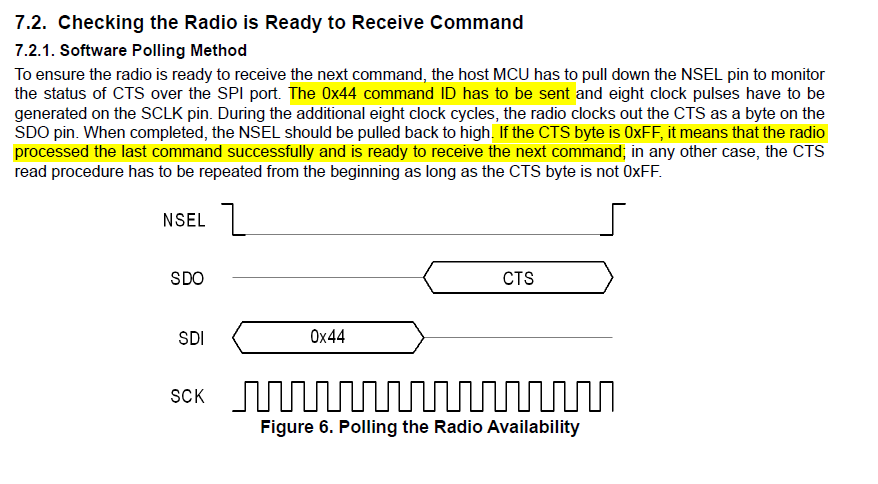
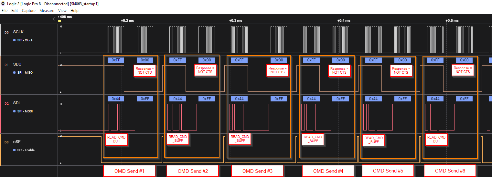
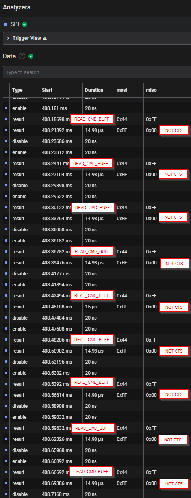
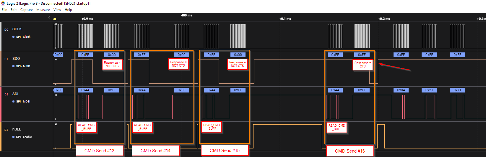
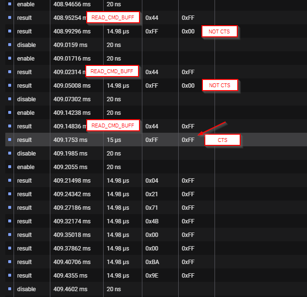

# Si4063 signal capture notes

## Reference

- [Application Note AN633: PROGRAMMING GUIDE FOR EZRADIOPRO® Si4X6X DEVICES](../../docs/AN633.pdf)
- [API documentation (zip file)](../../docs/EZRadioPRO_REVC2_API.zip)

## Capture method

Saleae Logic Pro 8 using Logic 2 software.

PCBite probes on STM pins for Si4063 SPI:
- PB2 = CS/nSEL
- PA7 = SDI
- PA6 = SDO
- PA5 = SCLK

## Startup Capture

### Wait for CTS 

On power up, the MCU should sent the READ_BUFF_CMD (0x44) until the Si4063 sents back a CTS signal (0xFF).

From AN633 Section 7.2 pg 15:

In the Logic 2 capture file ["SI4063_startup1.sal"](SI4063_startup1.sal) shows the MCU sending READ_CMD_BUFF commands to the Si4063, but NOT receiving the CTS response.

This can also be seen in the analyzer table below

## Receive CTS signal

The CTS signal is not received until transmit attempt #16 shown below.

## Data

| Packet Number | Tx Start | CTS Response | Bytes | Transmit Data (HEX) | Receive Data (HEX) | 
| :-----------: | :------: | :----------: | :---: | :-----------------: | :----------------: |
| 1 | 409.21498 ms | 413.39180 ms | 8 | 04 21 71 4B 00 00 BA 9E | FF FF FF FF FF FF FF FF |
| 2 | 413.46040 ms | 413.79694 ms | 8 | 05 48 23 2E 2B 90 B1 4E | FF FF FF FF FF FF FF FF |
| 3 | 413.86554 ms | 414.20980 ms | 8 | EA 3F B9 E8 8B A9 CA D6 | FF FF FF FF FF FF FF FF |
| 4 | 414.28388 ms | 414.62840 ms | 8 | 05 D2 E5 BE D1 27 55 82 | FF FF FF FF FF FF FF FF |
| 5 | 414.69702 ms | 415.04130 ms | 8 | E5 56 2A 3B 76 76 96 48 | FF FF FF FF FF FF FF FF |