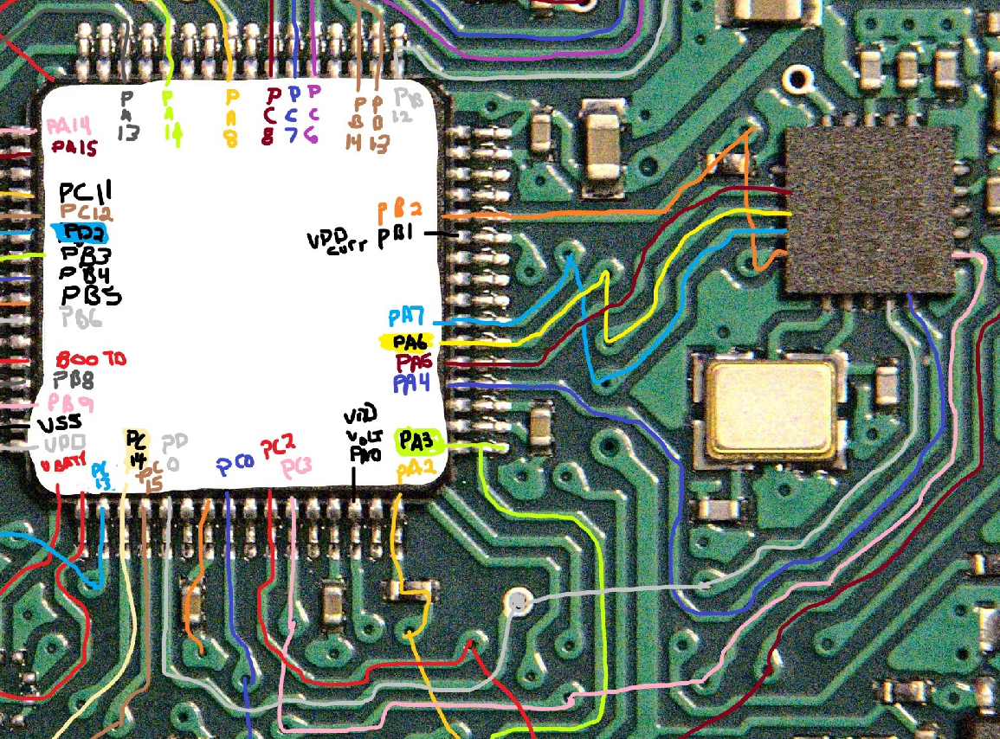

# Si4063 signal capture notes

## Reference

- [Application Note AN633: PROGRAMMING GUIDE FOR EZRADIOPRO® Si4X6X DEVICES](../../docs/AN633.pdf)
- [API documentation (zip file)](../../docs/EZRadioPRO_REVC2_API.zip)

## Capture method

Saleae Logic Pro 8 using Logic 2 software.

PCBite probes on STM pins for Si4063 SPI:
- PB2 = CS/nSEL
- PA7 = SDI
- PA6 = SDO
- PA5 = SCLK

## Startup Capture

### Wait for CTS 

On power up, the MCU should sent the READ_BUFF_CMD (0x44) until the Si4063 sents back a CTS signal (0xFF).

From AN633 Section 7.2 pg 15:

In the Logic 2 capture file ["SI4063_startup1.sal"](SI4063_startup1.sal) shows the MCU sending READ_CMD_BUFF commands to the Si4063, but NOT receiving the CTS response.

This can also be seen in the analyzer table below

## Receive CTS signal

The CTS signal is not received until transmit attempt #16 shown below.

##  Setup Packets from Firmware

| Packet Number | FW Address | Bytes | Transmit Data (HEX) | Command Type |
| :-----------: | :--------- | ----: | :------------------ | :----------- |
| 01 | 0x0000a012 | 08 | 04 21 71 4B 00 00 BA 9E | |
| 02 | 0x0000a01b | 08 | 05 48 23 2E 2B 90 B1 4E | |
| 03 | 0x0000a024 | 08 | EA 3F B9 E8 8B A9 CA D6 | |
| 04 | 0x0000a02d | 08 | 05 D2 E5 BE D1 27 55 82 | |
| 05 | 0x0000a036 | 08 | E5 56 2A 3B 76 76 96 48 | |
| 06 | 0x0000a03f | 08 | 05 8E 26 D8 5D 01 A7 88 | |
| 07 | 0x0000a048 | 08 | E2 89 CC 63 79 95 00 4B | |
| 08 | 0x0000a051 | 08 | 05 E0 75 CD A4 B9 46 BC | |
| 09 | 0x0000a05a | 08 | EA D3 37 D2 9A 89 82 EA | |
| 10 | 0x0000a063 | 08 | 05 0C AE 4C F5 F6 3C B3 | |
| 11 | 0x0000a06c | 08 | E9 A7 70 DF F1 14 4F 04 | |
| 12 | 0x0000a075 | 08 | 05 FE 5B DF 47 0A 7C 5B | |
| 13 | 0x0000a07e | 08 | E2 FB 3E 21 A2 1B AA 93 | |
| 14 | 0x0000a087 | 08 | 05 BF FD AB 69 6C A8 5A | |
| 15 | 0x0000a090 | 08 | E2 66 B7 2E 2C 45 2D FB | |
| 16 | 0x0000a099 | 08 | 05 0D 55 BD C2 37 00 72 | |
| 17 | 0x0000a0a2 | 08 | E2 FF 57 4D 7C 6C 00 2C | |
| 18 | 0x0000a0ab | 08 | 05 9E F2 46 FD D3 16 1B | |
| 19 | 0x0000a0b4 | 08 | EA 16 7F 67 4D E5 E2 C8 | |
| 20 | 0x0000a0bd | 08 | 05 37 33 1C FA BB EE EF | |
| 21 | 0x0000a0c6 | 08 | EA 00 5F BE A4 FC BF C1 | |
| 22 | 0x0000a0cf | 08 | 05 95 12 2F 0A CF 55 8C | |
| 23 | 0x0000a0d8 | 08 | E7 70 C2 D4 F0 81 95 C8 | |
| 24 | 0x0000a0e1 | 08 | E7 72 00 F9 8D 15 01 A3 | |
| 25 | 0x0000a0ea | 08 | E7 18 E5 6C 51 1F 86 9F | |
| 26 | 0x0000a0f3 | 08 | E7 DD 37 59 4B AD B0 9C | |
| 27 | 0x0000a0fc | 08 | E7 C8 E8 84 CD 55 41 83 | |
| 28 | 0x0000a105 | 08 | EF 4F 8E 38 CB 37 02 87 | |
| 29 | 0x0000a10e | 08 | E7 F5 00 88 4C 09 65 CE | |
| 30 | 0x0000a117 | 08 | EF DD BC 65 62 AC 75 62 | |
| 31 | 0x0000a120 | 08 | E7 C0 F1 5D 98 B0 DD 43 | |
| 32 | 0x0000a129 | 08 | E7 19 B4 F8 9F 6D 8C CB | |
| 33 | 0x0000a132 | 08 | E1 DE 63 C2 32 C6 E4 2F | |
| 34 | 0x0000a13b | 08 | 05 F4 33 B7 2E 72 9A F9 | |
| 35 | 0x0000a144 | 08 | E7 65 D9 38 B8 FE 31 16 | |
| 36 | 0x0000a14d | 08 | E7 F3 06 2D F5 FE 0C 38 | |
| 37 | 0x0000a156 | 08 | E7 70 4F E7 49 B4 58 39 | |
| 38 | 0x0000a15f | 08 | EF F1 46 A9 23 38 64 C0 | |
| 39 | 0x0000a168 | 08 | E7 09 4E 04 D3 46 15 02 | |
| 40 | 0x0000a171 | 08 | EF 8D C7 20 C3 90 87 4D | |
| 41 | 0x0000a17a | 08 | EF 00 AB 7F 27 02 C6 A0 | |
| 42 | 0x0000a183 | 08 | E7 23 A6 A6 A4 27 11 7D | |
| 43 | 0x0000a18c | 08 | EF B3 F1 9E 6A B3 19 AF | |
| 44 | 0x0000a195 | 08 | E7 AB F5 15 78 5E 48 F8 | |
| 45 | 0x0000a19e | 08 | EF 5B B1 2E AF 2A FF 16 | |
| 46 | 0x0000a1a7 | 08 | E7 30 62 5C 82 7A 3F 83 | |
| 47 | 0x0000a1b0 | 08 | EF 91 A7 D3 1B 64 85 BE | |
| 48 | 0x0000a1b9 | 08 | E7 4D 81 94 E4 AA E8 DB | |
| 49 | 0x0000a1c2 | 08 | EF A0 CC 4A 23 A5 7E 36 | |
| 50 | 0x0000a1cb | 08 | EF 0C 72 4C FB 26 5A EC | |
| 51 | 0x0000a1d4 | 08 | EF 0E 42 FA AF 49 A0 A8 | |
| 52 | 0x0000a1dd | 08 | E7 6D 12 DF 2B 0C 61 58 | |
| 53 | 0x0000a1e6 | 08 | EA B6 9B DE 81 B9 FF FF | |
| 54 | 0x0000a1ef | 08 | 05 04 EB D8 12 D6 8D E0 | |
| 55 | 0x0000a1f8 | 08 | EC 29 66 4B DE B7 DE 36 | |
| 56 | 0x0000a201 | 08 | 05 0D 28 B9 0A 89 31 1A | |
| 57 | 0x0000a20a | 07 | 02 81 01 01 86 A0 00    | |
| 58 | 0x0000a212 | 08 | 13 10 0F 07 04 00 0B 00 | |
| 59 | 0x0000a21b | 06 | 11 00 02 00 62 60       | |
| 60 | 0x0000a222 | 05 | 11 00 01 03 20          | |
| 61 | 0x0000a228 | 05 | 11 01 01 00 00          | |
| 62 | 0x0000a22e | 08 | 11 02 04 00 00 00 00 00 | |
| 63 | 0x0000a237 | 05 | 11 10 01 04 21          | |
| 64 | 0x0000a23d | 10 | 11 20 0C 00 6B 00 07 01 86 A0 05 86 A0 00 00 01 | |
| 65 | 0x0000a24e | 05 | 11 20 01 0C 33          | |
| 66 | 0x0000a254 | 10 | 11 20 0C 18 01 80 08 03 60 00 70 20 0C E8 01 40 | |
| 67 | 0x0000a265 | 10 | 11 20 0C 24 01 99 9A 00 CD 00 C2 00 54 62 80 6B | |
| 68 | 0x0000a276 | 07 | 11 20 03 30 01 E5 80    | |
| 69 | 0x0000a27e | 05 | 11 20 01 35 E0          | |
| 70 | 0x0000a284 | 10 | 11 20 0C 38 11 46 46 80 1A 99 9A 00 2A 0C 84 23 | |
| 71 | 0x0000a295 | 07 | 11 20 03 45 8F 00 9C    | |
| 72 | 0x0000a29d | 06 | 11 20 02 50 94 09       | |
| 73 | 0x0000a2a4 | 05 | 11 20 01 54 03          | |
| 74 | 0x0000a2aa | 08 | 11 22 04 00 08 7F 00 1F | |
| 75 | 0x0000a2b3 | 0B | 11 23 07 00 2C 0E 0B 04 0C 73 03 | |
| 76 | 0x0000a2bf | 0B | 11 40 07 00 4D 09 00 00 04 00 20 | |

## Additional Setup Packets

Note the response packets below do not have including the "0xFF 0xxFF" response to the "0x44" READ_CMD_BUFF.

| Packet Number | Bytes | Command/Response | Data (HEX) | Command Type |
| :-----------: | ----: | :----------- | :--------- | :----------- |
| 77            | 01    | Command      | 33         | |
| 78            | 02    | Response     | 03 00      | | 
| 79            | 02    | Command      | 34 03      | |
| 80            | 0B    | Command      | 11 40 04 00 4D 05 B4 00 04 00 20 | |
| 81            | 06    | Command      | 11 20 02 0D 00 00 | |
| 82            | 06    | Command      | 11 20 02 0B 01 33 | |
| 83            | 02    | Command      | 34 07      | |
| 84            | 01    | Command      | 33         | |
| 85            | 02    | Response     | 07 00      | |
| 86            | 02    | Command      | 34 03      | |
| 87            | 0B    | Command      | 11 40 04 00 4D 05 B4 00 04 00 20 | |
| 88            | 02    | Command      | 34 07      | |
| 89            | 01    | Command      | 33         | |
| 90            | 02    | Response     | 00 00      | |
| 91            | 02    | Command      | 34 03      | |
| 92            | 0B    | Command      | 11 40 04 00 4D 05 B4 00 04 00 20 | |