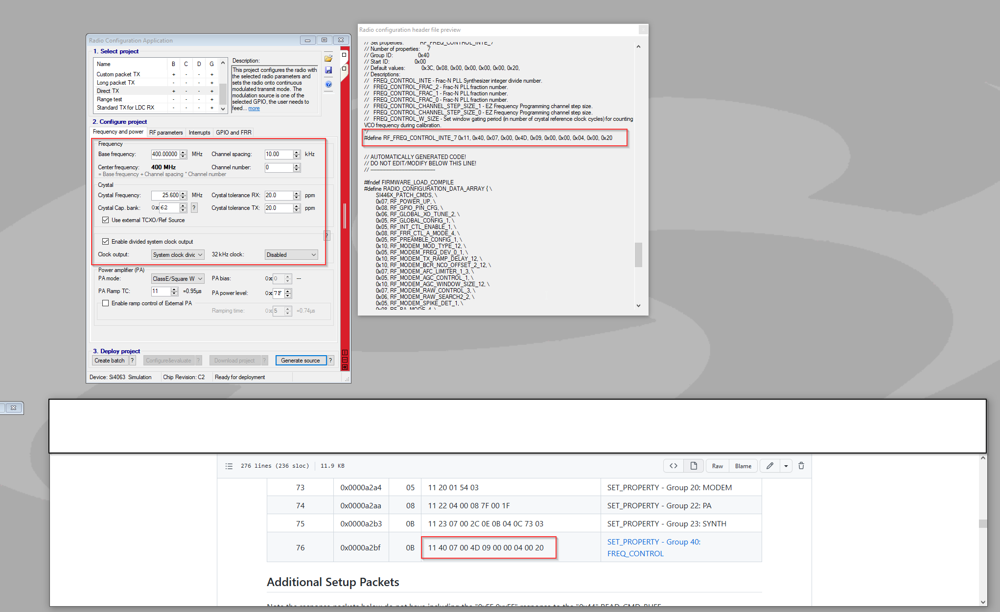

# Pkt 76 - RF_FREQ_CONTROL_INTE_7

**Summary**
```
Set properties:           RF_FREQ_CONTROL_INTE_7
Number of properties:     7
Group ID:                 0x40
Start ID:                 0x00
Default values:           0x3C, 0x08, 0x00, 0x00, 0x00, 0x00, 0x20, 
Descriptions:
  FREQ_CONTROL_INTE - Frac-N PLL Synthesizer integer divide number.
  FREQ_CONTROL_FRAC_2 - Frac-N PLL fraction number.
  FREQ_CONTROL_FRAC_1 - Frac-N PLL fraction number.
  FREQ_CONTROL_FRAC_0 - Frac-N PLL fraction number.
  FREQ_CONTROL_CHANNEL_STEP_SIZE_1 - EZ Frequency Programming channel step size.
  FREQ_CONTROL_CHANNEL_STEP_SIZE_0 - EZ Frequency Programming channel step size.
  FREQ_CONTROL_W_SIZE - Set window gating period (in number of crystal reference clock cycles) for counting VCO frequency during calibration.

```

**Packet***
```
LENGTH:     0x 0B
DATA:       0x 11 40 07 00 4D 09 00 00 04 00 20
```

## Property 00 - FREQ_CONTROL_INTE

**Summary:**    Frac-N PLL Synthesizer integer divide number.

**Byte:**       0x 4D = 0b 0100 1101


| Property | Bits | Value            | Function         | Decode |
| -------: | ---: | ----:            | :-------         | :----- |
| 0x00     | 6:0  | 0b1001101 = 77d  | INTE             | 77d    |

## Property 01:03 - FREQ_CONTROL_FRAC

**Summary:**    Frac-N PLL Synthesizer integer divide number.

**Bytes:**       0x 09 00 00 = 0b 0000 1001 0000 0000 0000 0000

$RF_{Channel_{Hz}}=\left(fc_{inte}+\frac{fc_{frac}}{2^{19}}\right) \times \left(\frac{N_{PRESC} \times freq\_xo}{outdiv}\right)$

| Property | Bits | Value            | Function         | Decode |
| -------: | ---: | ----:            | :-------         | :----- |
| 0x01     | 3:0  | 0b1001           | FRAC[19:16]      |        |
| 0x02     | 7:0  | 0b0000 0000      | FRAC[15:8]       |        |
| 0x03     | 7:0  | 0b0000 0000      | FRAC[7:0]        |        |

FRAC = 0x 09 00 00 = 589,824d

## Property 04:05 - FREQ_CONTROL_CHANNEL_STEP_SIZE

**Summary:**    EZ Frequency Programming channel step size.

**Bytes:**      0x 04 00 = 0b 0100 0000 0000 0000


| Property | Bits | Value            | Function         | Decode |
| -------: | ---: | ----:            | :-------         | :----- |
| 0x04     | 7:0  | 0b01000000       | CHANNEL_STEP_SIZE[15:8] | |
| 0x05     | 7:0  | 0b00000000       | CHANNEL_STEP_SIZE[7:0]  | |

Channel Step Size = 0x 04 00 = 1024d

*\*Note:* WDS3 Utility shows 0x0400 is equivalent to 10Khz channel step size

FREQ_CONTROL_CHANNEL_STEP_SIZE property is given by the following equation:

$FREQ\_CTRL\_CHAN\_STEP\_SIZE=\frac{2^{19} \times outdiv \times Desired\_Stepsize\_Hz}{N_{PRESC} \times freq\_xo}$

Whereas: 

- $outdiv = 10$
- $Desired\_Stepsize\_Hz =\ 1024$
- $N_{PRESC} = 2$
- $freq\_xo = 25,600,000$

$FREQ\_CTRL\_CHAN\_STEP\_SIZE =\ 104.8576 Hz$

## Property 06 - FREQ_CONTROL_W_SIZE

**Summary:**    Set window gating period (in number of crystal reference clock cycles) for counting VCO frequency during calibration.

**Bytes:**      0x 20 = 32d

*\*Note: This property does not need to change as a function of crystal reference frequency; the chip automatically calculates the target VCO count value as a function of crystal reference frequency and thus this property may remain constant. Silicon Labs recommends setting this property always to 0x20.*

| Property | Bits | Value            | Function         | Decode |
| -------: | ---: | ----:            | :-------         | :----- |
| 0x06     | 7:0  | 0x20 = 32d       | W_SIZE           |        |

# WDS3 Validations

